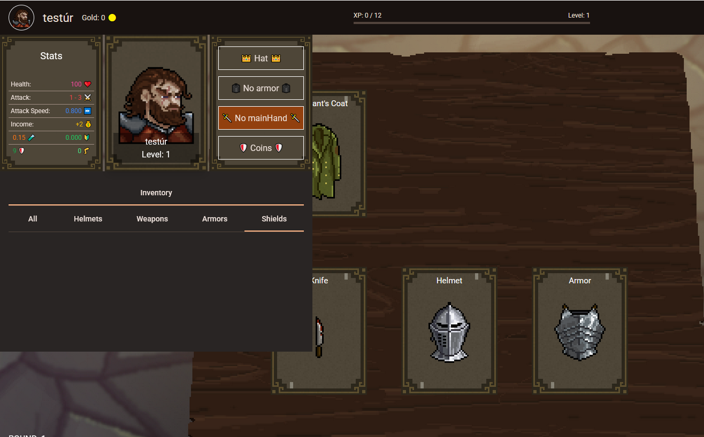
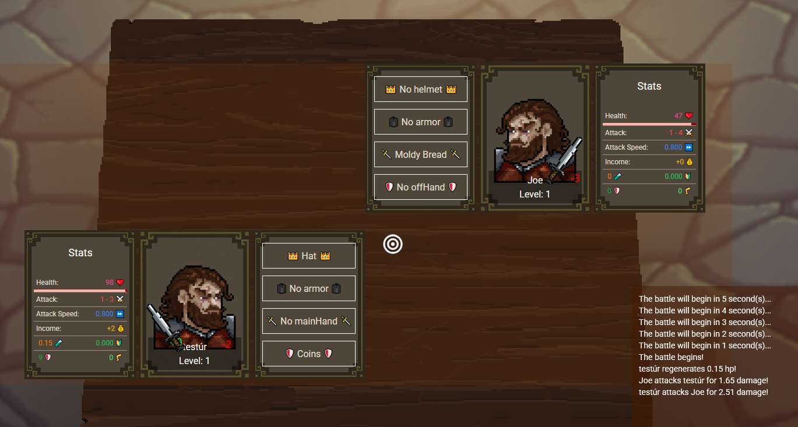

# Chungus Battles Frontend

This is the front-end of the game Chungus Battles, created with:

  
   
  
   
  
   
  

## Live Demo
https://arongida.github.io/chungus-battles-frontend

## Run Locally

Run `ng serve --hmr` for a dev server. Navigate to `http://localhost:4200/`. Needs the game server running to work at the specified endpoints in the environment.development.ts

## Game description

Chungus Battles is a turn-based auto-battler where strategic decisions in the draft phase directly impact your performance in battle.

🃏 Draft Phase

In each turn, you'll have the chance to:

    Buy items and gain XP

    Equip items to your character

    Select the best talent that suits your strategy

    Lock your shop to preserve good options for the next round

    Make tactical choices to prepare for upcoming battles

Careful planning in this phase is key to outsmarting your opponents.

  

⚔️ Battle Phase

Face off against other players' characters who are at the same turn count as you.

    Battles are fully automatic

    Watch your build come to life in combat

  

🏆 Win Conditions

    Lose 3 battles — you're eliminated

    Endgame: the final phase becomes King of the Hill, where surviving players battle for dominance until one remains!
